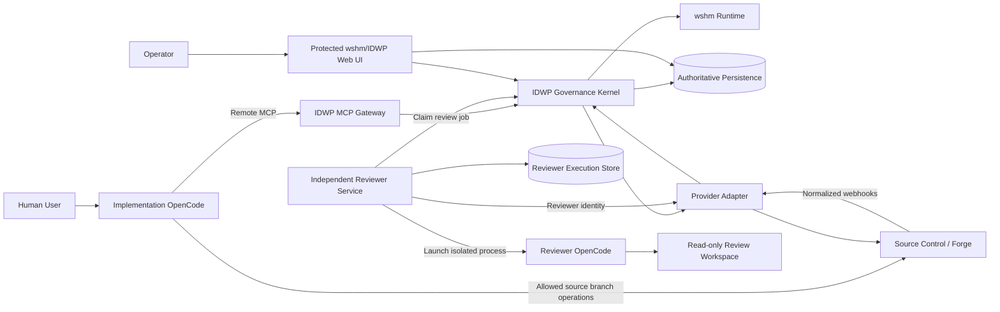

# Independent Development Workflow Platform - Architecture

**Status:** Normative architecture baseline  
**Version:** 2.0  
**Date:** 2026-07-27

## 1. Architectural Summary

IDWP is a maintained extension and shallow fork of wshm.

wshm supplies the repository-automation and agent-execution foundation. IDWP adds a provider-neutral governance kernel, remote MCP gateway, independent reviewer service, cost ledger, reporting, and stronger separation-of-duties controls.

The architecture contains three operational planes:

1. **Implementation Plane** - the user's OpenCode instance and working copy.
2. **Governance Plane** - wshm plus IDWP workflow extensions, MCP, provider adapters, persistence, gates, and reporting.
3. **Independent Review Plane** - a separate reviewer service that launches its own OpenCode instance and owns the reviewer provider identity.

## 2. System Context



## 3. Upstream and IDWP Ownership

### Upstream-owned responsibilities

Retain upstream implementations when verified suitable:

- repository registration and synchronization;
- webhook intake and normalization;
- agent-job execution infrastructure;
- existing provider adapters;
- PR/MR review and fix-loop mechanics;
- merge queue or integration coordination;
- base dashboard and operational views;
- persistence, queue, and migration infrastructure;
- deployment packaging and observability.

### IDWP-owned responsibilities

- provider-neutral workflow policy and state machine;
- Feature Branch ID and request correlation;
- MCP server and tool contracts;
- separation of implementation and reviewer authority;
- reviewer job contract and signed attestations;
- exact-head review validity and invalidation;
- required on-change-request discussion binding;
- validation evidence and gate calculation;
- feature-to-develop-to-master-to-develop promotion;
- local finalization instructions;
- AI request usage and cost ledger;
- detailed reporting and exports;
- provider capability model and conformance suite;
- guideline translation and governance documentation.

## 4. Rust Workspace Strategy

The exact upstream workspace is discovered in Epic 1. The target extension shape is conceptually:

```text
wshm-upstream/
    upstream crates and applications

idwp/
    crates/
        idwp-domain/
        idwp-application/
        idwp-policy/
        idwp-provider-contract/
        idwp-provider-github/
        idwp-mcp/
        idwp-review-contract/
        idwp-cost-ledger/
        idwp-reporting/
        idwp-audit/
    services/
        idwp-reviewer/
    web/
        dashboard extensions following upstream UI conventions
    migrations/
    conformance/
    deployment/
    docs/
```

If upstream uses another layout, preserve dependency direction rather than forcing these paths literally.

## 5. Dependency Direction

```text
Provider adapters -----> Application -----> Domain
MCP transport --------> Application -----> Domain
Web/API --------------> Application -----> Domain
Persistence ----------> Application ports
Reviewer service -----> Review contract
wshm integration -----> IDWP application ports
```

The domain MUST NOT depend on:

- GitHub, GitLab, Azure DevOps, Bitbucket, or Gitea SDKs;
- wshm transport or database types;
- MCP SDK types;
- OpenCode process APIs;
- web framework types;
- provider webhook payloads.

## 6. Core Components

### 6.1 IDWP Governance Kernel

Owns:

- workflow aggregates and transitions;
- policy evaluation;
- required actions and blocking conditions;
- review requirements and exceptions;
- validation freshness;
- promotion planning;
- provider capability checks;
- gate decisions;
- audit events.

It is deterministic and extensively unit tested.

### 6.2 wshm Integration Layer

Adapts upstream jobs, repositories, users, webhooks, dashboards, and provider operations to IDWP application ports.

It MUST isolate upstream-specific types and make rebase conflicts visible.

### 6.3 MCP Gateway

A Rust service or upstream-integrated endpoint exposing a small outcome-oriented MCP surface over authenticated Streamable HTTP.

It does not expose raw provider APIs. It returns compact state, references to large evidence, allowed actions, required actions, and blocking conditions.

### 6.4 Provider Adapter Layer

Implements the contract in `006_SOURCE_CONTROL_PROVIDER_CONTRACT.md`.

The first production adapter is GitHub. Verified upstream GitLab and Gitea behavior should be normalized behind the same contract rather than discarded.

### 6.5 Independent Reviewer Service

Runs outside the implementation harness and preferably outside the Governance Service trust boundary.

It:

- claims leased review jobs;
- creates isolated read-only workspaces at exact commits;
- launches a separate OpenCode process;
- captures actual model/runtime usage;
- validates structured findings;
- publishes findings through the reviewer identity;
- signs and submits review attestations;
- performs rechecks.

### 6.6 Persistence

Use upstream persistence and migration infrastructure where it can satisfy the logical model. Add IDWP tables or a separate extension schema/database only when needed.

The physical database engine is pinned in Epic 1. Domain and repository contracts remain database-neutral.

### 6.7 Reporting Web Application

Extend the existing wshm dashboard where practical. A separate UI is allowed only when extension limitations are documented.

Required views include workflows, reviews, provider operations, logs, AI requests, tokens, cost, feature totals, telemetry quality, and reconciliation status.

## 7. Provider Capability Model

Each adapter reports capabilities such as:

```text
ChangeRequests
InlineReviewComments
ResolvableDiscussions
RequiredCommitGates
ProtectedBranches
MergeQueue
AutoMerge
ServiceIdentities
WebhookDeliveryIds
BranchDeletionProtection
ForcePushProtection
ServerSideHooks
```

Policy asks for outcomes rather than provider mechanisms. The adapter either:

- implements the outcome;
- implements a documented equivalent;
- reports the capability unavailable and blocks production integration;
- operates in explicit advisory mode for non-production use.

## 8. Source-of-Truth Matrix

| Concern | Authoritative source |
|---|---|
| Workflow phase and transition history | IDWP persistence |
| Repository commits and refs | Source-control provider |
| Human-visible review conversation | Provider change request |
| Review validity for a commit | IDWP review attestation and current provider head |
| Provider branch enforcement | Provider configuration plus IDWP verification |
| Required workflow gate | IDWP gate record plus provider-visible gate |
| AI usage and cost | IDWP request ledger with telemetry provenance |
| Reviewer runtime execution | Reviewer execution store and signed result |
| Upstream version and patches | `UPSTREAM.md`, lockfiles, and release metadata |

## 9. Communication Paths

- Implementation OpenCode to IDWP: authenticated MCP.
- Implementation OpenCode to provider: limited source-branch operations using implementer identity.
- Governance to provider: workflow identity through adapter.
- Reviewer to Governance: reviewer-only authenticated API or reviewer-side MCP.
- Reviewer to provider: reviewer identity through adapter.
- Provider to Governance: signed webhooks plus periodic reconciliation.
- Operator to system: protected web UI/API.

## 10. Review Conversation Enforcement

For every review finding:

1. Reviewer Service creates a provider discussion and stores its provider reference.
2. Implementation response must be posted in that same discussion.
3. Fix evidence and validation summary must be posted there.
4. Reviewer recheck result must be posted there.
5. Only reviewer acceptance may transition the finding to accepted.
6. Provider conversation resolution, when supported, must match IDWP state.
7. The workflow gate remains non-passing when any required binding is missing.

For providers without resolvable discussions, the adapter must provide an equivalent immutable discussion record and the gate must still enforce the lifecycle.

## 11. Local Workspace Boundary

The remote Governance Service generally cannot manipulate the user's local working tree.

After remote promotion and sync-back, it returns a signed or authoritative local-finalization plan:

- fetch and prune;
- check out `develop`;
- fast-forward to expected provider commit;
- delete eligible local feature/release branches;
- verify clean working tree.

The implementation harness executes the actions and reports evidence. The workflow becomes `Completed` only after local finalization or a documented user-approved exception.

## 12. Durability and Idempotency

Every externally retried operation uses an idempotency key. Every workflow transition is persisted before dependent side effects are considered complete. Webhooks are deduplicated. Reviewer jobs use leases. Reconciliation repairs missed or reordered events.

No authoritative state may exist only in process memory.

## 13. Non-Functional Requirements

### Security

- least privilege;
- no shared implementer/reviewer credentials;
- no workflow-gate spoofing;
- exact-commit review binding;
- signed webhooks and reviewer attestations;
- secure secret storage;
- provider rules verified continuously.

### Reliability

- restart-safe workflow execution;
- idempotent operations;
- lease recovery;
- webhook replay safety;
- provider reconciliation;
- backup and restore.

### Maintainability

- shallow upstream fork;
- clear extension crates;
- provider conformance tests;
- architecture tests;
- documented patches;
- automated upstream rebase checks.

### Performance

- compact MCP responses;
- paged evidence and logs;
- indexed reporting queries;
- asynchronous provider and reviewer operations;
- bounded concurrency per repository.

### Accessibility

All administrative and reporting UI changes must meet WCAG 2.2 AA and preserve upstream accessibility or improve it.

## 14. Architecture Acceptance Criteria

The architecture is successfully implemented when:

- upstream wshm builds and tests at a pinned revision;
- IDWP-owned domain crates have no provider or upstream dependency;
- GitHub works through the generic adapter contract;
- a mock second provider passes the same conformance suite;
- implementation and reviewer services use separate identities and runtimes;
- findings are enforced through provider-visible discussions;
- review is invalidated by a new commit;
- promotion and sync-back complete end to end;
- request-level costs roll up to a stable Feature Branch ID;
- the dashboard exposes correlated logs and costs;
- upstream updates can be evaluated through documented compatibility tests.
