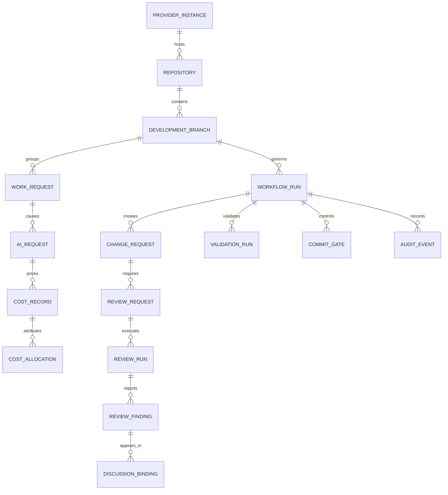

# Independent Development Workflow Platform - Domain Model

**Status:** Normative domain specification  
**Version:** 2.0  
**Date:** 2026-07-27

## 1. Purpose

This document defines provider-neutral concepts and invariants. Names in this document must not depend on GitHub, GitLab, Azure DevOps, Bitbucket, Gitea, the physical database, wshm internals, MCP, or OpenCode.

## 2. Aggregate Overview



## 3. Provider and Repository Concepts

### ProviderInstance

Represents one configured source-control or forge endpoint.

Fields include:

- stable internal ID;
- provider kind;
- base URI;
- tenant or organization reference where applicable;
- capability snapshot;
- authentication profile reference;
- enabled/advisory/disabled mode;
- configuration version.

### Repository

A provider-neutral repository registration.

Invariants:

- provider repository IDs are references, not domain primary keys;
- default development and production branches are policy data;
- a repository is bound to one active provider instance at a time;
- migration between providers preserves internal Repository ID and branch/workflow history.

### ProviderReference

A typed external reference containing:

- provider kind;
- provider instance ID;
- object type;
- opaque external ID;
- optional URI;
- version or etag where available;
- bounded provider-specific metadata.

The domain never parses provider IDs for business meaning.

### ProviderCapabilitySet

A versioned set of capabilities reported by the adapter. Policy decisions record the capability version used.

## 4. Branch and Work Concepts

### DevelopmentBranch

A durable internal branch lineage with stable `DevelopmentBranchId`.

Fields include:

- repository ID;
- current provider branch reference;
- branch type: Feature, Release, Hotfix, SyncBack, Administrative, Other;
- logical name;
- source/base branch ID or provider ref;
- created and retired times;
- current head commit;
- active workflow ID;
- parent and related feature branch IDs.

For a Feature branch, `DevelopmentBranchId` is the authoritative Feature Branch ID for cost and reporting.

Branch rename or deletion does not change the internal ID.

### WorkRequest

One user or automation instruction that caused work.

Examples:

- implement a feature;
- fix a review finding;
- sync to master;
- perform reviewer recheck;
- retry failed validation.

Required correlation:

- repository;
- DevelopmentBranch ID or explicit administrative scope;
- workflow;
- actor;
- harness session;
- parent request when delegated;
- normalized request type;
- timestamps and status.

Raw prompt text is optional protected data, not required for ordinary reporting.

### AgentSession

Represents one implementation, reviewer, delegated, or operator-assisted harness session.

It records requested and observed runtime identity without treating model self-report as authoritative.

### AIRequest

One actual model invocation or attempt.

Each retry is separate. Required usage and cost fields are defined in `014_AI_USAGE_COST_AND_REPORTING.md`.

## 5. Workflow Concepts

### WorkflowRun

The aggregate coordinating one governed development endeavor.

It owns:

- workflow type;
- source and destination branch lineage;
- current phase;
- requested final destination;
- current head commit;
- required actions;
- blocking conditions;
- validation state;
- review state;
- promotion plan;
- local-finalization state;
- concurrency version.

### WorkflowPolicy

Versioned structured policy defining:

- branch naming and source rules;
- permitted destination paths;
- validation requirements;
- independent-review triggers and exceptions;
- provider capability requirements;
- gate requirements;
- cleanup and local-finalization behavior;
- risk classifications.

Markdown guidelines explain policy intent. Structured policy is the deterministic enforcement source. Conflicts fail closed.

### RequiredAction

An action the implementation harness, reviewer, operator, or provider must complete.

### BlockingCondition

A condition preventing a transition. Blocking conditions have stable reason codes and evidence references.

### PromotionPlan

A persisted ordered plan of branch and change-request steps.

For a feature promoted to production, the default path is:

```text
feature/X -> develop -> release/X -> master -> develop sync-back
```

The plan is recalculated only through an audited transition.

### LocalFinalizationPlan

Actions to restore the implementation working copy to policy-defined final state. For the current branch model, the normal final state is current, clean `develop`.

## 6. Change-Request Concepts

### ChangeRequest

The neutral equivalent of a pull request or merge request.

Fields include:

- provider reference;
- source and target refs;
- current head and base commits;
- state;
- mergeability snapshot;
- required gate references;
- review decision summary;
- associated feature branches;
- created, updated, integrated, and closed times.

### ChangeRequestDiscussion

A provider-visible conversation associated with a change request. It may be inline or general.

### DiscussionBinding

Binds an IDWP finding or response to a provider-visible discussion and comments.

Required references may include:

- top-level discussion;
- reviewer finding message;
- implementation decision response;
- fix and validation response;
- reviewer recheck response;
- provider resolution state.

## 7. Review Concepts

### ReviewRequest

An immutable review assignment tied to:

- workflow;
- change request;
- exact head commit;
- policy version;
- guideline applicability snapshot;
- review profile;
- package manifest and evidence references;
- required reviewer isolation properties;
- expiry and lease rules.

### ReviewRun

One execution attempt by the Reviewer Service.

It records:

- authenticated service identity;
- reviewer OpenCode process/session;
- actual observed model/provider;
- workspace and commit verification;
- prompt/profile version;
- start/end/status;
- usage and cost links;
- signed result digest;
- limitations and failure details.

### ReviewFinding

A specific independent-review item.

Required fields:

- stable finding ID;
- sequence number within the change request;
- severity and category;
- concise title;
- explanation and evidence;
- repository-relative location where applicable;
- risk and recommended action;
- blocking status;
- guideline/policy references;
- current lifecycle state;
- discussion binding.

### ReviewDecision

A commit-bound decision: Approved, ChangesRequired, Rejected, Inconclusive, or Cancelled.

No approval remains valid after the change-request head changes.

### ReviewAttestation

A reviewer-signed statement containing:

- review request ID;
- change request ID;
- exact reviewed commit;
- decision;
- finding digest;
- reviewer service identity;
- runtime identity;
- completion time;
- signature and key ID.

## 8. Validation Concepts

### ValidationRequirement

A policy-derived expected validation path.

### ValidationRun

One execution and its outcome, tied to a commit.

Fields include:

- requirement ID;
- command or runner identifier;
- environment classification;
- start/end;
- exit status;
- warning count;
- summary;
- bounded evidence references;
- actor and session;
- tested commit;
- freshness state.

### ValidationEvidence

A protected artifact reference, digest, bounded excerpt, or structured result. Full unbounded logs are not stored in ordinary response fields.

## 9. Gate and Provider Operation Concepts

### CommitGate

A neutral required status attached to a commit/change request.

States: Pending, Passing, Failing, Error, Superseded.

The provider adapter maps this to check runs, statuses, policies, pipelines, or an equivalent mechanism.

### ProviderOperation

An idempotent record of an attempted provider side effect.

It contains:

- operation type;
- idempotency key;
- request digest;
- provider reference;
- attempt count;
- status;
- response metadata;
- error classification;
- timestamps.

## 10. Cost Concepts

### CostRecord

Immutable or versioned pricing result for an AIRequest.

### CostAllocation

Attributes a cost record to one or more DevelopmentBranch IDs without double counting. Shared release/review/promotion work uses explicit allocation rules.

## 11. Audit Concepts

### Actor

A human, implementation service, reviewer service, workflow service, integration service, provider, or operator.

### AuditEvent

Append-only record of a material decision, transition, configuration change, security event, provider operation, review action, cost correction, or exception.

Audit events contain no secrets.

## 12. Domain Invariants

1. A WorkflowRun has exactly one current phase.
2. A Feature branch has one stable Feature Branch ID for its lifetime.
3. Every governed WorkRequest is tied to a branch or explicit administrative scope.
4. Every AIRequest is tied to one WorkRequest.
5. A review decision is valid only for its exact commit.
6. The implementation session cannot be the reviewer session.
7. A blocking finding cannot be closed by the implementation actor.
8. A required finding cannot advance without a provider-visible discussion binding.
9. A passing gate cannot exist while required validation is stale or failing.
10. A passing review gate cannot exist while a blocking finding lacks reviewer acceptance.
11. A promotion step cannot skip the policy-defined branch path.
12. A provider limitation cannot silently downgrade a required control.
13. Unknown usage or cost cannot be recorded as known zero.
14. Provider object IDs cannot serve as domain primary keys.
15. An externally visible side effect must have an idempotent ProviderOperation record.

## 13. Domain Events

Representative events:

- WorkflowStarted
- BranchRegistered
- WorkRequestRecorded
- ValidationRecorded
- ChangeRequestCreated
- ReviewRequired
- ReviewJobClaimed
- ReviewSubmitted
- FindingReported
- DevelopmentResponsePosted
- FixReadyForRecheck
- ReviewReopened
- ReviewApproved
- ReviewInvalidatedByNewCommit
- GateChanged
- ChangeRequestIntegrated
- PromotionStepStarted
- SyncBackCompleted
- LocalFinalizationRequested
- WorkflowCompleted
- UsageRecorded
- CostCalculated
- ProviderCapabilityChanged

Events are internal domain facts, not provider webhook payloads.
