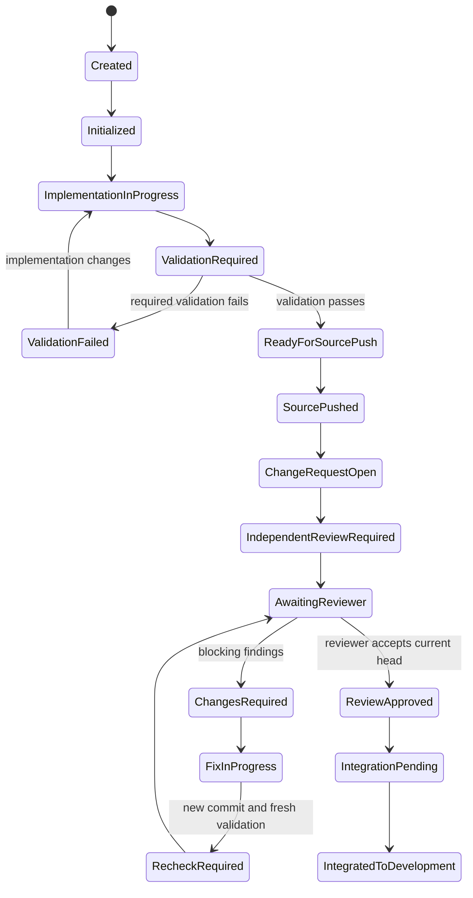
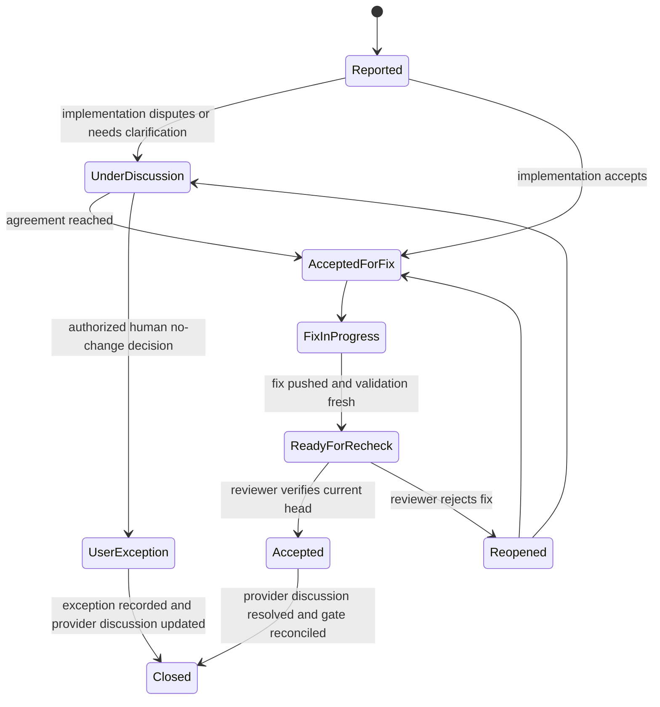

# Independent Development Workflow Platform - Workflow State Machine

**Status:** Normative behavior specification  
**Version:** 2.0  
**Date:** 2026-07-27

## 1. Purpose

All governed work is represented by explicit, persisted state machines. Controllers, MCP handlers, provider webhooks, and wshm jobs call the state machine; they do not implement policy independently.

## 2. Primary Workflow States

```text
Created
Initialized
ImplementationInProgress
ValidationRequired
ValidationFailed
ReadyForSourcePush
SourcePushed
ChangeRequestRequired
ChangeRequestOpen
IndependentReviewRequired
AwaitingReviewer
ChangesRequired
FixInProgress
RecheckRequired
ReviewApproved
IntegrationPending
IntegratedToDevelopment
ReleasePreparation
ProductionChangeRequestOpen
ProductionIntegrationPending
IntegratedToProduction
SyncBackRequired
SyncBackOpen
RemotePromotionCompleted
LocalFinalizationRequired
Completed
Blocked
Cancelled
Failed
```

State names may be represented differently in code, but legal transitions and semantics are normative.

## 3. Universal Transition Rules

Every transition MUST:

- validate expected current state and concurrency version;
- identify the acting principal;
- verify repository and provider capability assumptions;
- verify current source and change-request head commits;
- persist the transition and audit event;
- create required provider operations idempotently;
- return required actions, allowed actions, blocking conditions, and next action;
- fail closed on ambiguous policy or stale evidence.

## 4. Feature Workflow to `develop`



## 5. Full `sync to master` Workflow

A user request such as `sync this code to master`, `promote to master`, or equivalent means the entire workflow, not only the next merge.

For feature work:

```text
feature/X
  -> change request to develop
  -> independent review/fix/recheck
  -> integrate to develop
  -> create release/X from current develop
  -> production change request to master
  -> required review or documented exception
  -> integrate to master
  -> change request master to develop
  -> sync-back review exception or review as policy requires
  -> integrate sync-back
  -> remote branch cleanup
  -> local checkout/fetch/prune/clean verification on develop
  -> Completed
```

The workflow may pause for findings or operational failure. It resumes automatically from the persisted plan after blocking conditions are removed.

## 6. Release Workflow

A release branch starts from `develop`.

Allowed work is stabilization only. New features are prohibited.

Default review exception:

- release contains exactly one previously reviewed feature;
- no stabilization or unrelated changes were added;
- associated feature review and validation remain valid;
- provider and policy evidence prove the condition.

Uncertainty requires review.

After production integration, `master` must be synchronized back into `develop` through a change request.

## 7. Hotfix Workflow

A hotfix starts from `master`, requires validation and independent review, integrates to `master`, then synchronizes to `develop` through a change request.

The urgency classification does not remove review unless an explicit emergency policy and authorized human exception exists. Emergency use is auditable and never inferred from wording alone.

## 8. Review Finding State Machine



The implementation actor cannot transition a finding to Accepted or Closed.

## 9. Required PR/MR Conversation Loop

When the reviewer reports a finding:

1. The Reviewer Service posts `Code Review NNN: <summary>` to the change request.
2. IDWP stores the discussion and reviewer message references.
3. The implementation agent posts one of:
   - `Development Response: Accepted`;
   - `Development Response: Accepted with Conditions`;
   - `Development Response: Rejected`.
4. When fixing, the implementation agent posts changed files, commit, and validation summary in the same discussion.
5. IDWP requests a recheck for the new exact head.
6. Reviewer Service posts accepted or not accepted in the same discussion.
7. Reviewer acceptance permits closure/resolution.
8. The gate passes only after all required bindings and states reconcile.

Private API messages alone do not satisfy the conversation requirement.

## 10. New Commit Invalidation

When the change-request head changes:

- prior review approval becomes stale;
- the review gate becomes Pending or Failing;
- open accepted findings may require targeted recheck or full review according to policy;
- validation tied to the prior commit becomes stale where affected;
- any queued merge is cancelled or blocked;
- a new review request references the new head.

The provider webhook path and periodic reconciliation both enforce this rule.

## 11. Review Exceptions

Default exceptions:

- clean production-to-development sync-back with no additional change;
- one-feature release with no additional stabilization or unrelated work.

Exceptions are computed by IDWP from repository evidence. The implementation harness cannot self-declare them.

Each exception records:

- policy rule;
- evidence;
- associated reviewed change request;
- current commits;
- actor;
- expiry and invalidation conditions;
- provider-visible explanation.

## 12. Integration Gate Conditions

A change request is integration-ready only when:

- source and target are policy-correct;
- current head matches IDWP state;
- required validation is current and passing;
- required warnings are resolved or explicitly excepted;
- review is approved for current head or valid exception exists;
- every blocking finding is Accepted or has authorized UserException;
- required provider-visible conversations exist;
- provider conversations are resolved where supported;
- required provider gate is passing;
- provider branch rules remain compliant;
- no unresolved blocking condition exists.

## 13. Local Finalization

After remote promotion and sync-back, state becomes `LocalFinalizationRequired`.

IDWP returns expected actions and commits. The implementation harness must report:

- fetch/prune result;
- final checked-out branch;
- final commit;
- clean working tree;
- deleted local branches;
- any deviation.

Normal invariant:

```text
current branch = develop
current commit = expected remote develop commit
working tree = clean
```

Failure does not roll back remote production integration. It creates a recoverable local-finalization block and operator-visible alert.

## 14. Cancellation and Abandonment

Cancellation requires an authorized actor and records:

- current state;
- remote artifacts left in place;
- branches and change requests to retain or close;
- review jobs to cancel;
- cost and audit completion;
- safe local branch recommendation.

A running reviewer job may finish, but its result is rejected if the workflow or review request is cancelled.

## 15. Provider Capability Effects

If a provider lacks a required native capability:

- use a documented equivalent control when it provides equal enforcement;
- otherwise block production workflow;
- advisory mode may be enabled only for non-production repositories and must be visible in all status/reporting views.

Local Git without a forge cannot claim full change-request conversation enforcement unless server-side hooks and an equivalent discussion/audit service are configured.

## 16. State-Machine Test Requirements

Tests must cover:

- every legal transition;
- every illegal transition;
- stale concurrency versions;
- wrong commit;
- duplicate/reordered webhooks;
- review fixes and rechecks;
- new-commit invalidation;
- every review exception;
- feature, release, hotfix, sync-back, and full promotion;
- provider capability absence;
- restart and retry behavior;
- final local branch verification.
