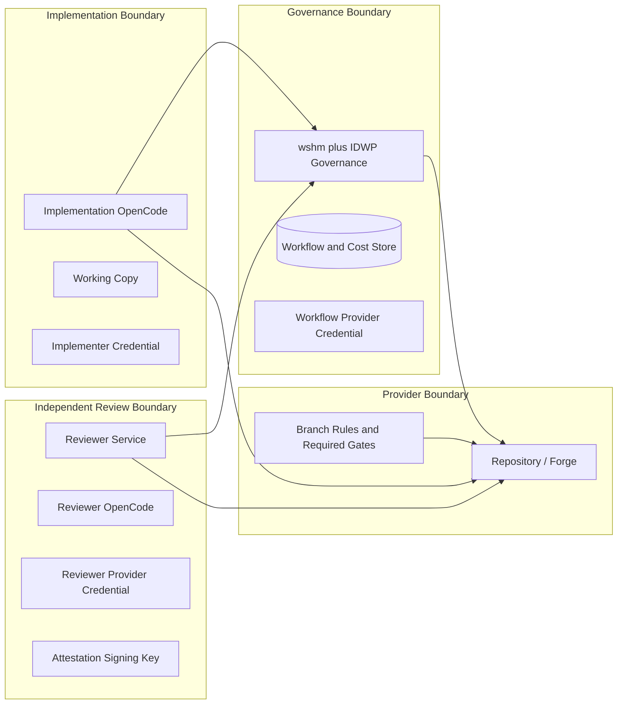

# Independent Development Workflow Platform - Security Model

**Status:** Normative security specification  
**Version:** 2.0  
**Date:** 2026-07-27

## 1. Security Objective

The implementation agent must not be able to cause its own unreviewed code to enter a protected branch, fabricate independent approval, suppress review findings, spoof the required gate, or alter the controls that constrain it.

## 2. Trust Boundaries

Repository contents and model outputs are untrusted inputs even when produced internally.

## 3. Required Identities

### Implementation identity

May:

- read permitted repositories;
- push permitted source branches;
- create/update change-request content;
- respond to findings;
- request workflow actions.

Must not:

- write protected branches;
- bypass provider rules;
- publish the authoritative workflow gate;
- submit reviewer approval;
- access reviewer/workflow secrets;
- change provider policy;
- administer IDWP.

### Workflow identity

May:

- inspect repository/provider state;
- create required gates;
- create/coordinate change requests;
- reconcile provider discussions;
- perform policy-authorized integration or enable auto-merge;
- manage workflow-owned webhooks.

It must not impersonate the reviewer opinion.

### Reviewer identity

May:

- read exact review commits;
- create formal reviews and findings;
- request changes or approve;
- reply on recheck;
- resolve its own accepted discussions where provider policy permits.

It must not author implementation commits or change governance policy.

### Integration identity

Optional separate identity. It may integrate only when provider rules and IDWP gates are passing. Prefer provider auto-merge or narrowly scoped integration over granting merge power to the implementation identity.

### Operator identity

Administers configuration through audited protected paths. Human administrators must not use bypass casually; emergency bypass requires explicit policy and audit.

## 4. Operational Separation

Reviewer Service MUST have:

- separate process/service account or container identity;
- separate provider credential;
- separate OpenCode configuration;
- separate workspace root;
- separate model credential or workload identity where practical;
- separate logs and execution database/namespace;
- signing key inaccessible to implementation and governance processes;
- network policy allowing only required endpoints.

The implementation process cannot write reviewer binaries, prompts, configs, or secrets.

## 5. Source-Control Enforcement

For production-capable providers, protected development and production branches require:

- change-request-only integration;
- required IDWP gate from the expected workflow identity;
- required validation gates;
- no force pushes;
- no deletion;
- stale review invalidation;
- required discussion resolution where supported;
- no implementation identity bypass;
- no ordinary administrator bypass when provider supports that setting.

The provider adapter continuously verifies the effective policy. Drift fails the IDWP gate.

## 6. Conversation Integrity

The reviewer publishes findings directly through the reviewer identity. The implementation agent cannot intercept them.

IDWP stores provider references for every required message. Gate calculation checks:

- finding message author/identity;
- implementation response author/identity;
- fix report;
- reviewer recheck author/identity;
- current head commit;
- provider resolution state;
- IDWP finding state.

A manually resolved discussion without reviewer acceptance does not satisfy the gate.

## 7. Reviewer Attestation

Reviewer results are signed by the Reviewer Service.

The signed payload includes:

- review request ID;
- repository and change request internal IDs;
- exact head commit;
- decision;
- digest of findings and limitations;
- reviewer service instance;
- OpenCode session/runtime identity;
- completion time;
- nonce or result version.

Governance validates signature, key status, review lease, and commit before accepting the result.

## 8. MCP and API Security

- authenticated TLS for remote MCP and APIs;
- per-client identity, repository scope, and operation authorization;
- no bearer token in URLs or logs;
- replay protection/idempotency keys for mutations;
- bounded request and response sizes;
- rate limiting;
- audit for every mutation;
- reviewer submission endpoint unavailable to implementation credentials;
- administrative APIs isolated from agent APIs;
- large artifacts fetched through short-lived authorized references.

## 9. Secrets

Secrets must not be stored in source, ordinary database columns, model prompts, logs, comments, PR descriptions, command lines, or MCP results.

Use the deployment platform's approved secret store, file permissions, workload identity, or vault. Private keys should be non-exportable where practical.

Secrets are rotated independently per identity.

## 10. Model and Agent Risks

Model output is untrusted. Structured output is schema-validated and semantically checked.

Reviewer OpenCode runs with:

- read-only repository workspace;
- no implementation credential;
- no workflow-admin credential;
- no arbitrary provider mutation tools beyond reviewer operations;
- bounded shell commands;
- network allowlist where practical;
- resource and time limits;
- fresh context isolated from implementation conversation.

Prompt injection in repository content must not grant tools or alter system policy.

## 11. Upstream and Supply-Chain Security

Because IDWP depends on wshm:

- pin upstream commit and dependencies;
- verify checksums/signatures where available;
- run dependency and license scans;
- review upstream changes before merge;
- maintain a software bill of materials;
- run Rust security/advisory tooling;
- prohibit unreviewed automatic upstream updates;
- test provider adapters and gate behavior after every rebase.

## 12. SSPL Compliance Control

License files and notices are protected release artifacts. CI verifies their presence.

External hosted-service use requires a documented legal/compliance review. The system must be deployable from the corresponding source and deployment materials required by the accepted license interpretation.

## 13. Provider Capability Risk

A provider may offer weaker controls than GitHub. The capability model must not pretend otherwise.

Examples:

- no protected branches;
- no resolvable discussions;
- no expected-source status gate;
- no service identities;
- no webhook signatures;
- local Git with only filesystem access.

Policy classifies repositories as Enforced, EquivalentControl, Advisory, or Unsupported. Production promotion is allowed only in Enforced or approved EquivalentControl mode.

## 14. Threats and Required Mitigations

| Threat | Required mitigation |
|---|---|
| Implementation self-approves | Separate reviewer identity and signed attestation. |
| Implementation spoofs gate | Provider requires gate from workflow identity; credential isolated. |
| New commit after approval | Webhook/reconciliation invalidates review and gate. |
| Finding hidden privately | Reviewer posts directly to provider discussion. |
| Manual discussion resolve | Gate checks reviewer acceptance and database state. |
| Provider rules weakened | Continuous policy reconciliation and fail-closed gate. |
| Reviewer service compromised | Least privilege, signing-key rotation, audit, isolated environment. |
| Prompt injection | Tool restrictions, read-only review workspace, structured output validation. |
| Webhook replay | Signature verification, delivery deduplication, timestamps. |
| Cost records forged | Automatic telemetry, provenance, immutable corrections, reconciliation. |
| Upstream supply-chain compromise | Pinning, review, SBOM, security scan, rebase tests. |
| Admin bypass | Restricted owners, audited emergency procedure, alerts. |

## 15. Security Acceptance Tests

At minimum prove:

1. implementation cannot push `develop` or `master`;
2. implementation cannot create passing workflow gate;
3. implementation cannot call reviewer-result endpoint;
4. implementation cannot access reviewer secrets or workspace;
5. reviewer cannot push implementation commits;
6. wrong-SHA or unsigned review is rejected;
7. new commit invalidates approval;
8. manual conversation resolution does not pass gate;
9. provider-policy drift blocks integration;
10. webhook replay is harmless;
11. upstream rebase cannot bypass architecture/security tests;
12. local/advisory provider is clearly prevented from claiming enforced production status.
