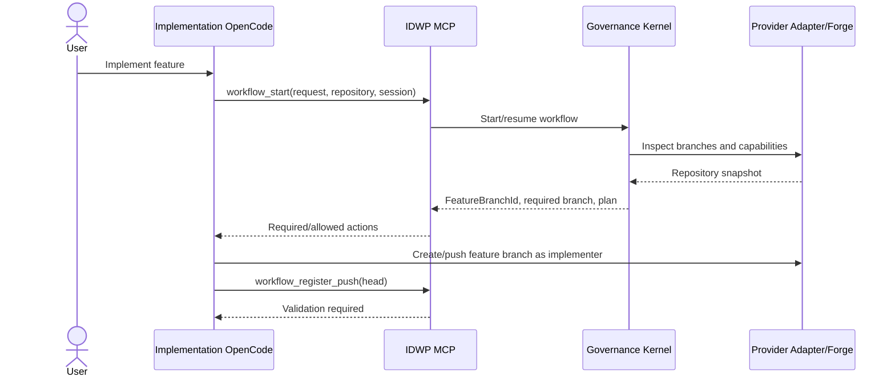
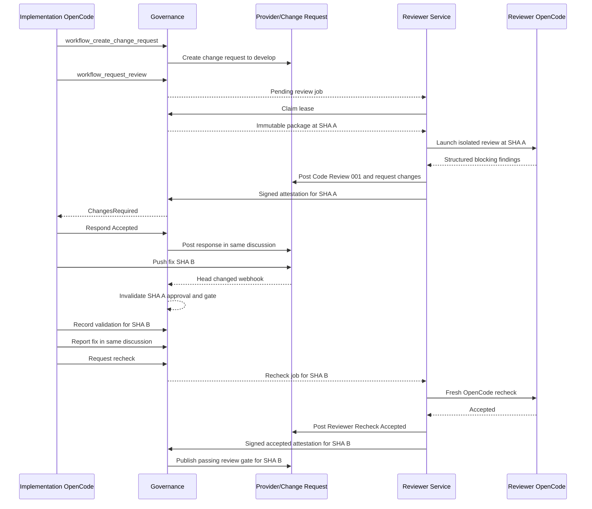
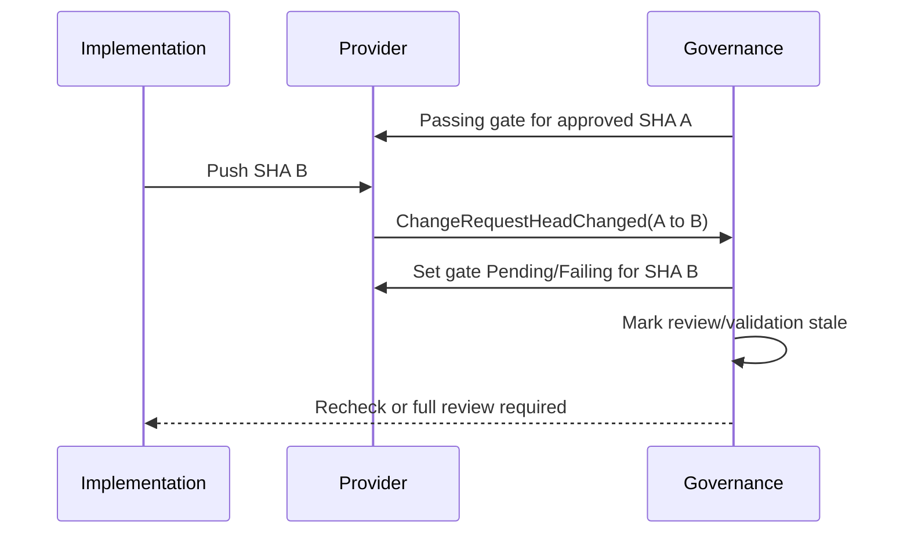
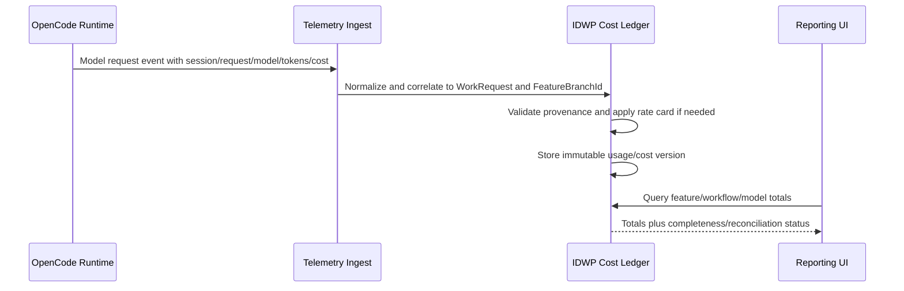
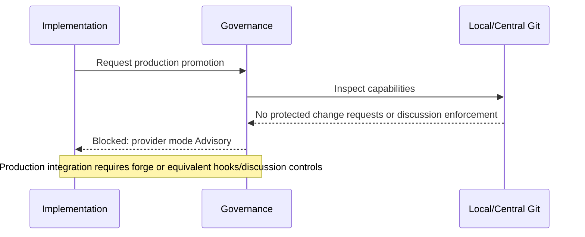

# Independent Development Workflow Platform - Sequence Diagrams

**Status:** Normative interaction specification  
**Version:** 2.0  
**Date:** 2026-07-27

## 1. Start Feature Work



## 2. Feature Review With Findings



## 3. Full Sync to Production

```mermaid
sequenceDiagram
    actor User
    participant Impl as Implementation OpenCode
    participant Gov as IDWP Governance
    participant Rev as Reviewer Service
    participant SCM as Source-Control Provider

    User->>Impl: Sync this code to master
    Impl->>Gov: workflow_promote(destination=Production)
    Gov->>SCM: Ensure feature change request to develop
    Gov->>Rev: Request independent review if required
    Rev->>SCM: Publish review/rechecks
    Gov->>SCM: Integrate feature to develop after gates
    Gov->>SCM: Create release branch from current develop
    Gov->>SCM: Open production change request to master
    alt Release exception valid
        Gov->>SCM: Document exception and pass gate
    else Review required
        Gov->>Rev: Request release review
        Rev->>SCM: Publish review result
    end
    Gov->>SCM: Integrate release to master
    Gov->>SCM: Open master-to-develop sync-back change request
    Gov->>SCM: Apply sync-back review rule/exception
    Gov->>SCM: Integrate sync-back
    Gov->>SCM: Delete eligible remote branches
    Gov-->>Impl: Local finalization plan with expected develop SHA
    Impl->>SCM: Fetch/prune
    Impl->>Impl: Checkout and fast-forward develop; clean workspace
    Impl->>Gov: workflow_finalize_local(evidence)
    Gov-->>Impl: Completed
```

## 4. Recheck Not Accepted

```mermaid
sequenceDiagram
    participant Impl as Implementation
    participant Gov as Governance
    participant Rev as Reviewer Service
    participant SCM as Provider Discussion

    Impl->>Gov: Report fix for finding
    Gov-->>Rev: Recheck job
    Rev->>SCM: Reviewer Recheck Not Accepted with evidence
    Rev->>Gov: Signed ChangesRequired attestation
    Gov-->>Impl: Finding Reopened; gate failing
    Impl->>SCM: Continue same discussion
    Impl->>Gov: New fix and validation
```

## 5. New Commit After Approval



## 6. Manual Conversation Resolution Attempt

```mermaid
sequenceDiagram
    participant UserOrImpl as User/Implementation
    participant SCM as Provider
    participant Gov as Governance

    UserOrImpl->>SCM: Resolve discussion manually
    SCM->>Gov: DiscussionResolved event
    Gov->>Gov: Finding lacks reviewer acceptance
    Gov->>SCM: Keep gate failing; reopen when supported
    Gov-->>UserOrImpl: Reviewer acceptance still required
```

## 7. Reviewer Crash and Lease Recovery

```mermaid
sequenceDiagram
    participant Rev1 as Reviewer Worker 1
    participant Gov as Governance
    participant Rev2 as Reviewer Worker 2

    Rev1->>Gov: Claim review lease
    Rev1--xRev1: Process/host crashes
    Gov->>Gov: Lease expires; no valid attestation
    Rev2->>Gov: Claim pending/expired job
    Gov-->>Rev2: New lease and same immutable package
    Rev2->>Gov: Submit signed result
    Gov->>Gov: Reject any late result from old lease
```

## 8. Provider Outage

```mermaid
sequenceDiagram
    participant Gov as Governance
    participant SCM as Provider
    participant Op as Operator

    Gov->>SCM: Publish finding/gate/integration
    SCM--xGov: Temporary unavailable
    Gov->>Gov: Record retryable ProviderOperation
    Gov-->>Op: Workflow blocked; retry scheduled
    Gov->>SCM: Idempotent retry
    SCM-->>Gov: Success/existing provider reference
    Gov->>Gov: Reconcile and resume
```

## 9. Usage and Cost Flow



## 10. Local Git Advisory Mode


