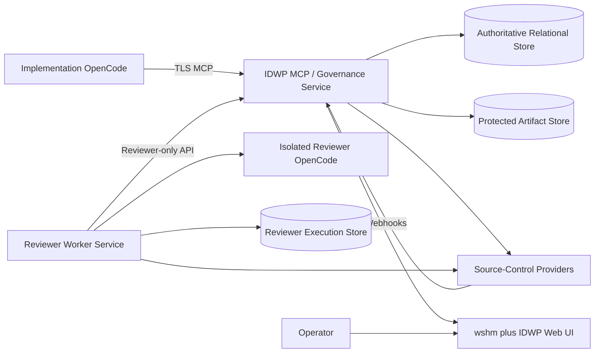

# Independent Development Workflow Platform - Deployment and Operations

**Status:** Normative deployment baseline  
**Version:** 2.0  
**Date:** 2026-07-27

## 1. Purpose

IDWP deploys as a wshm-based Rust platform, not a LAMP application.

The exact upstream-supported deployment topology is verified in Epic 1 and retained where it satisfies the requirements. This specification defines required security and operational outcomes rather than forcing an unrelated stack.

## 2. Reference Topology



Governance and Reviewer should run on separate hosts, VMs, or strongly isolated containers for production.

## 3. Runtime

Required baseline:

- supported Linux distribution or upstream-supported container platform;
- pinned stable Rust toolchain for builds;
- release binaries built reproducibly in CI;
- upstream wshm dependencies and UI build toolchain pinned;
- relational database supported by upstream or approved extension architecture;
- protected object/artifact storage;
- OpenCode runtime installed only on reviewer workers and implementation workstations as needed;
- TLS termination through upstream reverse proxy, ingress, or approved web server.

Do not introduce PHP/Symfony/Apache/MySQL merely to preserve the former design.

## 4. Service Separation

Use distinct identities for:

```text
idwp-governance
idwp-reviewer
idwp-deployment
idwp-readonly-operator
```

Requirements:

- no shared runtime credentials;
- reviewer signing key available only to reviewer service;
- workflow gate credential available only to governance;
- implementation credential never installed on servers;
- separate workspace and log directories;
- separate database roles;
- separate network policies;
- reviewer cannot administer governance;
- governance cannot execute reviewer OpenCode as reviewer identity unless an emergency procedure explicitly changes mode and is audited.

## 5. Deployment Modes

### Development

- local containers or upstream development composition;
- mock provider and sandbox provider instances;
- non-production model credentials;
- visible advisory-mode labels;
- disposable database/artifacts.

### Staging

- production-equivalent service separation;
- dedicated provider sandbox repositories/organizations;
- real webhooks and service identities;
- controlled reviewer model route;
- restore and failure tests.

### Production

- enforced provider mode only for production repositories;
- highly restricted operator access;
- monitored gate/policy drift;
- backups and tested restore;
- controlled upstream upgrade process;
- incident and emergency bypass procedures.

## 6. Packaging

Release artifacts include:

- pinned upstream revision metadata;
- IDWP source revision;
- Rust binaries or signed container images;
- UI assets following upstream build conventions;
- database migrations;
- configuration schema and sanitized templates;
- systemd, Compose, Helm, or other supported deployment assets;
- SBOM;
- license and notices;
- migration/rollback documentation;
- checksums/signatures.

Release packaging must preserve SSPL and dependency notices.

## 7. Configuration

Configuration is typed and validated at startup.

Categories:

- service endpoints;
- provider instances and non-secret identifiers;
- database/artifact connections;
- MCP auth and authorization;
- reviewer job/lease limits;
- OpenCode executable/profile references;
- model routes and rate cards;
- retention;
- logging/metrics;
- policy and guideline locations;
- feature flags;
- upstream compatibility version.

Secrets are references, never committed values.

## 8. Secret Provisioning

Use an approved platform mechanism such as:

- workload identity;
- Kubernetes secrets with encryption and access controls;
- systemd credentials;
- root-owned files mounted read-only;
- cloud or enterprise vault.

Required independent secrets:

- workflow provider identity;
- reviewer provider identity;
- optional integration identity;
- MCP client credentials;
- reviewer service client credential;
- webhook secrets;
- reviewer attestation key;
- model provider credentials;
- database credentials;
- artifact encryption credentials.

Rotation is tested and audited.

## 9. Network Policy

Governance requires:

- inbound MCP/API/UI/webhook routes;
- outbound provider APIs;
- database/artifact access;
- optional identity/rate-card services.

Reviewer requires:

- outbound Governance reviewer API;
- provider read/review API;
- approved model endpoints;
- repository fetch endpoint;
- reviewer execution store.

Reviewer does not require Governance admin or implementation-network access.

## 10. Provider Setup

Each provider deployment profile documents:

- service identities/apps/users;
- least-privilege permissions;
- webhook configuration;
- branch policy/rulesets/hooks;
- required gate/check configuration;
- discussion/review mapping;
- integration/auto-merge behavior;
- provider-specific rollback;
- capability mode.

GitHub is configured first. Provider-neutral core deployment cannot assume GitHub URLs or credentials.

## 11. MCP Registration

Provide sanitized OpenCode examples containing:

- remote MCP URL;
- authentication reference/environment variable;
- TLS trust requirements;
- server name;
- connection verification command;
- no secrets.

The deployed endpoint must expose health separately from authenticated MCP operations.

## 12. Reviewer OpenCode Runtime

Reviewer worker image/host includes:

- pinned OpenCode version;
- approved reviewer profile;
- restricted tools;
- telemetry integration;
- workspace cleanup tooling;
- process supervision;
- resource limits;
- network restrictions;
- no implementation provider credential.

A startup compatibility check verifies the expected OpenCode telemetry and structured-output behavior.

## 13. Database and Artifact Operations

- separate runtime and migration roles;
- TLS to remote databases where supported;
- backups encrypted and tested;
- point-in-time recovery where available;
- artifact digest verification;
- lifecycle/retention rules;
- no public artifact buckets;
- restore runbooks include mid-review and mid-promotion recovery.

## 14. Logging and Metrics

Structured logs include correlation IDs:

- workflow ID;
- WorkRequest ID;
- DevelopmentBranch ID;
- AIRequest ID;
- ReviewRequest/Run/Finding ID;
- provider operation and delivery ID;
- actor/service identity;
- commit.

Never log credentials, authorization headers, private keys, full prompts by default, or unbounded source content.

Metrics include:

- workflows by state;
- transition failures;
- review queue/lease age;
- provider latency/errors/rate limits;
- webhook lag and reconciliation drift;
- gate state;
- model tokens/cost;
- telemetry completeness;
- upstream version and patch health;
- storage/backup status.

## 15. Health and Readiness

Governance readiness checks:

- database and migration compatibility;
- artifact store;
- policy load/validation;
- provider adapter health;
- gate identity permission;
- reviewer service connectivity/queue;
- upstream/IDWP version compatibility.

Reviewer readiness checks:

- Governance reviewer API;
- signing key;
- provider reviewer permission;
- OpenCode executable/profile/telemetry;
- workspace capacity;
- model route health;
- execution store.

Health endpoints expose no secrets.

## 16. Upstream Upgrade Procedure

1. record current upstream and IDWP revisions;
2. fetch candidate upstream into a dedicated branch;
3. review release notes, license, dependency, schema, provider, agent-runtime, and security changes;
4. rebase or merge according to `UPSTREAM.md`;
5. update `PATCHES.md`;
6. run upstream tests;
7. run IDWP architecture, provider conformance, state-machine, reviewer, cost, and end-to-end tests;
8. migrate staging and run failure/recovery tests;
9. obtain independent review;
10. deploy with rollback point;
11. reconcile provider and workflow state.

No unattended production upstream upgrades.

## 17. Rollback

Rollback plans cover:

- binary/container rollback;
- schema compatibility or restore;
- provider rule changes;
- webhook changes;
- gate identity rotation;
- reviewer service rollback;
- OpenCode version rollback;
- cost-rate configuration rollback;
- upstream patch rollback.

Do not roll back a database past already-integrated workflow facts without reconciliation.

## 18. Backup and Disaster Recovery

Back up:

- workflow database;
- reviewer execution metadata;
- cost ledger;
- configuration metadata and policies;
- required artifacts;
- license/upstream/patch manifests;
- deployment and provider configuration exports.

Test restoration quarterly or according to policy. Recovery must detect provider state that advanced after the backup and reconcile rather than overwrite it.

## 19. SSPL Operational Documentation

Maintain deployable source and operational materials consistent with the accepted license obligations. Before providing the platform as a hosted service to parties outside the organization, complete legal review and document source-availability procedures.

## 20. Production Readiness Checklist

- [ ] Upstream repository, revision, and license verified.
- [ ] SBOM and security scans pass.
- [ ] Governance and Reviewer isolated.
- [ ] Provider identities use least privilege.
- [ ] Protected branches/gates verified.
- [ ] MCP authentication and authorization tested.
- [ ] Reviewer OpenCode runtime and telemetry tested.
- [ ] Database migration/backup/restore tested.
- [ ] Webhook replay/reconciliation tested.
- [ ] Cost ledger and reports reconcile.
- [ ] Failure modes exercised.
- [ ] Upstream rebase procedure documented.
- [ ] Rollback tested.
- [ ] Independent security/code review accepted.
