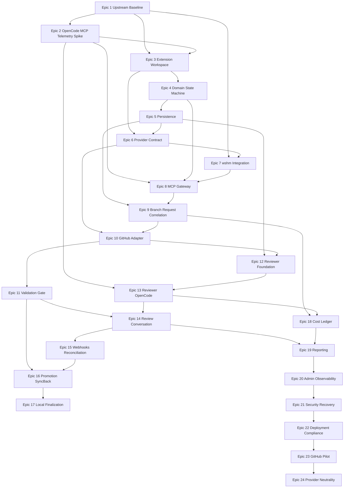

# Independent Development Workflow Platform - Epic Implementation Plan

**Status:** Executable roadmap  
**Version:** 2.0  
**Date:** 2026-07-27  
**Foundation:** maintained wshm fork and Rust extensions  
**First enforced provider:** GitHub  
**Architecture requirement:** provider-neutral core

## 1. Purpose

This plan divides IDWP into bounded epics that can be assigned one at a time:

```text
Implement Epic 1.
```

The implementation agent must read the complete epic, all referenced documents, root `AGENTS.md`, applicable guidelines, project-specific guidance, and current upstream metadata before changing files.

An epic is not complete when it is merely scaffolded. Code, tests, documentation, migrations, security, review, validation, and check-in evidence must be complete.

## 2. Global Execution Contract

For every epic, the implementation agent MUST:

1. create or use the policy-correct feature branch before changes;
2. create/update the required workspace implementation plan;
3. record the pinned upstream wshm revision and IDWP revision;
4. read all required specification documents;
5. classify applicable and non-applicable guidelines explicitly;
6. inspect existing upstream functionality before writing replacement code;
7. prefer configuration/extension crates over invasive fork patches;
8. document every upstream patch in `PATCHES.md`;
9. preserve provider neutrality and dependency direction;
10. implement only the epic and correctness/security prerequisites;
11. design every new behavior for automated testing;
12. map affected code paths to tests or approved live verification;
13. run formatting, lint, unit, integration, architecture, security, license, and relevant live tests;
14. treat warnings as defects unless explicitly excepted;
15. update user, operator, adapter, and upstream-maintenance documentation;
16. record model/runtime, tokens, cost, and telemetry quality for the epic when IDWP telemetry is available;
17. obtain independent review under the bootstrap or IDWP process;
18. keep findings, implementation responses, fixes, and rechecks visible in the provider change request;
19. commit, push, and integrate only through the currently applicable governed workflow;
20. stop at the epic boundary.

## 3. Bootstrap and Dogfood Strategy

### Bootstrap period

Until the IDWP reviewer and gate are operational, use the existing manual/Codex/OpenCode branch, PR, independent-review, and implementation-plan guidelines.

### Shadow mode

After the MCP, Governance, Reviewer Service, GitHub adapter, and gate exist, run IDWP in shadow mode on a sandbox repository. Compare decisions to the manual process.

### Enforced dogfood

Enable the required provider gate only after Epic 23 bypass tests pass. Later epics may then be governed by IDWP.

No epic may claim IDWP governed itself before enforcement was actually active.

## 4. Global Definition of Done

Every epic must satisfy applicable items:

- [ ] Scope complete without unrelated refactors.
- [ ] Upstream functionality inspected and reused where appropriate.
- [ ] Upstream revision and patch impact recorded.
- [ ] Provider-neutral domain preserved.
- [ ] Rust code formatted and linted with warnings denied.
- [ ] Unit and integration tests pass.
- [ ] Architecture/dependency-boundary tests pass.
- [ ] Security/advisory and license/SBOM checks pass.
- [ ] Database migrations and restore behavior tested when affected.
- [ ] Provider sandbox/live verification completed when affected.
- [ ] Reviewer/implementation identity separation preserved.
- [ ] User/operator documentation updated.
- [ ] Implementation plan updated with commands/results.
- [ ] Independent review accepted and rechecked after fixes.
- [ ] PR/MR discussion contains required review history.
- [ ] No secret appears in source, logs, fixtures, comments, or artifacts.
- [ ] All new provider operations are idempotent.
- [ ] All model calls are correlated and costed when telemetry capability exists.

## 5. Required Baseline Commands

Adapt exact commands to the verified upstream workspace. At minimum establish equivalents of:

```text
cargo fmt --check
cargo clippy --workspace --all-targets --all-features -- -D warnings
cargo test --workspace --all-features
cargo audit or approved advisory scanner
license/SBOM scan
upstream compatibility suite
provider conformance suite
```

Frontend, database, container, and end-to-end commands follow upstream tooling.

# Epic 1 - Upstream wshm Due Diligence, License, and Fork Baseline

## Objective

Verify the exact wshm upstream and create a reproducible, legally documented shallow fork baseline.

## Depends on

None.

## Required reading

- `000_ADOPTION_DECISION.md`
- `001_VISION.md`
- `002_ARCHITECTURE.md`
- `011_DEPLOYMENT.md`
- `015_GUIDELINE_TRANSLATION.md`

## Scope

1. Identify exact upstream repository, owner, default branch, releases, and commit.
2. Verify SSPL license files, notices, dependency licenses, and distribution requirements.
3. Inventory Rust workspace, frontend, database, migrations, queue, APIs, webhooks, provider adapters, agent runners, review/fix loops, merge behavior, dashboard, deployment, and tests.
4. Build and test upstream unmodified.
5. Create IDWP fork/remote strategy.
6. Add `UPSTREAM.md`, `PATCHES.md`, `LICENSE_COMPLIANCE.md`, and architecture inventory.
7. Produce before-change provider and security capability matrix.
8. Record assumptions disproved by inspection and update specification where necessary.

## Deliverables

- reproducible fork at pinned upstream revision;
- complete upstream inventory;
- verified license/notices and dependency report;
- baseline build/test evidence;
- upstream/rebase procedure;
- initial patch policy and source tree map;
- architecture decision confirmation or documented exit recommendation.

## Acceptance criteria

- upstream builds/tests without IDWP changes;
- exact source and license are unambiguous;
- physical persistence/UI/deployment technologies are documented;
- all existing provider and agent capabilities are recorded;
- the fork can fetch/rebase upstream without rewriting history;
- no IDWP feature code is implemented yet.

## Validation

- upstream documented build/test suite;
- dependency/license scan;
- clean clone/rebuild;
- release artifact notice check;
- independent architecture/license review.

## Out of scope

- workflow extensions;
- MCP implementation;
- provider administration changes.

# Epic 2 - OpenCode, MCP, and Telemetry Compatibility Spike

## Objective

Prove the exact technical interfaces required to connect OpenCode, Rust MCP, wshm agent execution, and request-level telemetry.

## Depends on

Epic 1.

## Required reading

- `002_ARCHITECTURE.md`
- `007_REVIEWER_SERVICE.md`
- `008_MCP_PROTOCOL.md`
- `014_AI_USAGE_COST_AND_REPORTING.md`

## Scope

1. Pin OpenCode version and noninteractive commands.
2. Prove a minimal Rust Streamable HTTP MCP server discoverable by OpenCode.
3. Test authentication, tools, resources, errors, reconnect, and restart.
4. Identify machine-readable OpenCode events/API/plugin/log interface for model route, tokens, cost, delegation, retries, status, and session IDs.
5. Inspect wshm agent execution telemetry and correlation IDs.
6. Prove an isolated reviewer OpenCode launch with read-only tools.
7. Document unsupported fields and fallback strategy.
8. Create compatibility tests that fail on upstream/OpenCode interface drift.

## Deliverables

- working compatibility prototype;
- pinned version matrix;
- telemetry schema examples;
- OpenCode launcher contract;
- MCP SDK/transport decision;
- compatibility test harness;
- risk/limitation report.

## Acceptance criteria

- OpenCode can call a remote authenticated Rust MCP tool;
- server restart does not lose authoritative state assumptions;
- implementation and reviewer sessions are distinguishable;
- actual model and token fields can be captured or explicitly classified unavailable;
- no natural-language self-report is required;
- no production workflow logic is implemented.

## Validation

- automated MCP protocol tests;
- OpenCode launch/restart/timeout tests;
- sample delegated and retry calls;
- token/cost reconciliation sample;
- independent technical review.

# Epic 3 - IDWP Extension Workspace and Quality Gates

## Objective

Create the IDWP-owned Rust crates/modules, CI quality gates, documentation structure, and guideline translation without changing workflow behavior.

## Depends on

Epics 1-2.

## Required reading

- `002_ARCHITECTURE.md`
- `015_GUIDELINE_TRANSLATION.md`

## Scope

1. Add IDWP extension workspace/crates following upstream layout.
2. Establish dependency direction and architecture tests.
3. Configure formatting, clippy warnings-as-errors, tests, advisory, license, and SBOM checks.
4. Add project-specific Rust, database, provider, reviewer, UI, secret, and upstream guidelines.
5. Add implementation-plan templates and code-path/test mapping.
6. Add CI checks for required license/notices and no forbidden dependency edges.
7. Add sanitized configuration examples.

## Deliverables

- compiling empty/skeletal IDWP crates;
- CI pipeline and local validation script;
- architecture tests;
- project-specific guidelines;
- contribution/upstream patch documentation.

## Acceptance criteria

- upstream behavior remains unchanged;
- all quality gates run in clean checkout;
- domain crate cannot depend on provider/wshm/web/persistence crates;
- warnings fail CI;
- required notices are checked.

## Out of scope

- domain behavior;
- persistence tables;
- MCP tools.

# Epic 4 - Provider-Neutral Domain Model and Workflow State Machine

## Objective

Implement the deterministic domain types, policies, transitions, invariants, and promotion plans.

## Depends on

Epic 3.

## Required reading

- `003_DOMAIN_MODEL.md`
- `004_WORKFLOW_STATE_MACHINE.md`
- `006_SOURCE_CONTROL_PROVIDER_CONTRACT.md`

## Scope

1. Implement IDs, value objects, enums, aggregates, and domain events.
2. Implement feature/release/hotfix/sync-back/full-production plans.
3. Implement review finding lifecycle and exact-commit validity.
4. Implement required actions and blocking conditions.
5. Implement provider capability classifications and fail-closed decisions.
6. Implement review exceptions with deterministic evidence inputs.
7. Implement local-finalization state.
8. Add property/table-driven tests for all transitions and illegal paths.

## Deliverables

- provider-neutral domain crate;
- structured policy schema and example policy;
- transition and invariant tests;
- architecture tests proving no provider/upstream dependencies.

## Acceptance criteria

- every state/transition in the specification is tested;
- implementation actor cannot close findings;
- new commit invalidates review/gates;
- production path cannot skip release/sync-back;
- capability absence blocks enforcement;
- domain has no GitHub/wshm/MCP/OpenCode types.

# Epic 5 - Persistence, Migrations, Audit, and Idempotency

## Objective

Persist IDWP logical state using the verified upstream database and migration framework.

## Depends on

Epics 1, 4.

## Required reading

- `010_PERSISTENCE_MODEL.md`
- `013_FAILURE_MODES.md`

## Scope

1. Decide extension tables/schema versus separate database based on Epic 1.
2. Implement repositories and transaction boundaries.
3. Implement workflow, transition, provider reference, operation, event, validation, review, gate, audit, and artifact metadata tables.
4. Implement optimistic concurrency and leases.
5. Implement idempotency keys and duplicate detection.
6. Add migrations, upgrade-from-upstream-baseline tests, backup/restore fixture.
7. Enforce separate reviewer/workflow write boundaries.

## Deliverables

- migrations and repositories;
- persistence integration tests;
- lease/idempotency utilities;
- backup/restore and schema upgrade documentation.

## Acceptance criteria

- workflows survive restart;
- duplicate operations are harmless;
- stale versions are rejected;
- review lease recovery works;
- audit is append-only;
- no secret stored;
- upstream upgrade test remains viable.

# Epic 6 - Source-Control Provider Contract and Conformance Kit

## Objective

Implement the neutral adapter SDK, capability model, normalized events, errors, and conformance suite.

## Depends on

Epics 3-5.

## Required reading

- `006_SOURCE_CONTROL_PROVIDER_CONTRACT.md`
- `012_PROVIDER_ADAPTER_ROADMAP.md`

## Scope

1. Implement neutral Rust traits/DTOs/errors/capabilities.
2. Implement mock provider covering full capability set.
3. Implement advisory/local minimal provider fixture.
4. Implement webhook normalization and provider-operation idempotency helpers.
5. Create adapter conformance test runner and sandbox fixture contracts.
6. Add provider capability report to administration API model.

## Deliverables

- provider contract crate;
- mock and advisory adapters;
- conformance suite;
- adapter developer guide.

## Acceptance criteria

- domain tests run against mock provider without GitHub types;
- unsupported capabilities are explicit;
- advisory provider cannot pass production policy;
- duplicate/reordered events are tested;
- a second fake provider compiles without core changes.

# Epic 7 - Normalize wshm Repository and Agent Capabilities

## Objective

Adapt existing wshm repository automation, agent jobs, reviews, merge handling, and dashboard infrastructure to IDWP ports without duplicating upstream code.

## Depends on

Epics 1, 3, 6.

## Scope

1. Map upstream repositories/jobs/providers/webhooks/reviews/merges to IDWP integration interfaces.
2. Identify capabilities safe to reuse unchanged.
3. Isolate required upstream patches.
4. Preserve upstream provider behavior in compatibility tests.
5. Expose stable integration APIs for Governance and Reviewer Service.
6. Document every upstream patch and rebase risk.

## Deliverables

- wshm integration crate/module;
- compatibility tests;
- patch inventory;
- mapping document.

## Acceptance criteria

- no redundant replacement of suitable upstream feature;
- upstream provider/agent tests continue passing;
- IDWP can invoke upstream jobs through narrow ports;
- domain remains upstream-independent;
- patches are minimal and reviewed.

# Epic 8 - Authenticated MCP Gateway

## Objective

Implement the production MCP endpoint and implementation-side tool contracts.

## Depends on

Epics 2, 4-7.

## Required reading

- `008_MCP_PROTOCOL.md`
- `005_SECURITY_MODEL.md`

## Scope

1. Implement Streamable HTTP MCP endpoint with authentication/authorization.
2. Implement common response envelope, state versions, errors, and idempotency.
3. Implement workflow_start/status and read-only resources first.
4. Implement validation, commit/push registration, change-request, review request, finding response, promotion, cancellation, and local-finalization tools as application ports become available.
5. Add paging/redaction/large-artifact references.
6. Add OpenCode configuration examples and integration tests.

## Deliverables

- MCP gateway service/module;
- complete tool schemas;
- auth policies;
- client documentation;
- OpenCode compatibility suite.

## Acceptance criteria

- implementation credential cannot call reviewer/admin operations;
- all mutations require idempotency and state version;
- compact responses do not dump full logs/diffs;
- restart/reconnect works;
- provider-specific details are optional opaque references.

# Epic 9 - Development Branch and Work Request Correlation

## Objective

Implement stable DevelopmentBranch/Feature Branch IDs and request/session correlation before broader automation.

## Depends on

Epics 5, 8.

## Required reading

- `003_DOMAIN_MODEL.md`
- `010_PERSISTENCE_MODEL.md`
- `014_AI_USAGE_COST_AND_REPORTING.md`

## Scope

1. Create/resolve branch lineage on workflow_start.
2. Track rename, deletion, release membership, sync-back, and provider migration refs.
3. Record top-level, child, delegated, fix, review, recheck, promotion, and local-finalization WorkRequests.
4. Enforce branch/admin scope for request ingestion.
5. Expose branch/request timeline APIs/resources.
6. Add unattributed exception queue with fail-closed rules for governed work.

## Deliverables

- branch/request services and tables;
- MCP request correlation;
- timeline views/APIs;
- migration/rename tests.

## Acceptance criteria

- branch name changes do not change Feature Branch ID;
- every governed AI request can reference a WorkRequest/branch;
- release shared work can relate to multiple features without duplication;
- missing correlation is visible and cannot silently become zero/unattributed.

# Epic 10 - GitHub Provider Adapter and Organization Configuration

## Objective

Deliver the first fully enforced source-control provider using GitHub while preserving neutral interfaces.

## Depends on

Epics 6-9.

## Required reading

- `005_SECURITY_MODEL.md`
- `006_SOURCE_CONTROL_PROVIDER_CONTRACT.md`
- `012_PROVIDER_ADAPTER_ROADMAP.md`

## Scope

1. Reuse/normalize verified upstream GitHub functionality.
2. Implement separate implementer/workflow/reviewer/optional integration identities.
3. Implement repository, branch, change request, discussion, review, gate, integration, webhook, and policy operations.
4. Implement inventory/plan/apply/verify/rollback for selected-repository rulesets/branch protection.
5. Configure required IDWP gate from expected workflow identity.
6. Block direct pushes, force pushes, deletion, and bypass as supported.
7. Implement signed webhook handling and reconciliation.
8. Create a dedicated sandbox organization/repository.

## Deliverables

- GitHub adapter passing conformance suite;
- administration tooling and backups;
- permission matrix;
- sandbox configuration;
- rollback artifacts.

## Acceptance criteria

- implementation identity cannot update protected branches or publish gate;
- reviewer identity cannot push implementation commits;
- workflow identity cannot impersonate reviewer review;
- policy drift is detected;
- all changes are narrow, inventoried, and verified;
- no GitHub type enters domain/MCP contracts.

# Epic 11 - Validation Evidence and Commit Gate Engine

## Objective

Implement validation requirements, evidence, freshness, gate calculation, and provider publication.

## Depends on

Epics 4-5, 8-10.

## Scope

1. Derive validation requirements from affected paths/policy.
2. Ingest structured validation evidence through MCP/API.
3. Tie runs to exact commits and mark stale after changes.
4. Calculate gate conditions from validation, review, discussions, policy, provider mode, and current head.
5. Publish/reconcile provider gate through workflow identity.
6. Add detailed gate summaries without secrets.

## Deliverables

- validation service and persistence;
- gate calculator/publisher;
- policy mapping;
- unit/integration/live tests.

## Acceptance criteria

- plain boolean evidence is insufficient;
- warnings and failures block according to policy;
- new commit invalidates affected validation;
- implementation cannot spoof passing gate;
- gate source identity is verified;
- calculations are reproducible/auditable.

# Epic 12 - Reviewer Service Foundation and Isolation

## Objective

Create the independent Reviewer Service boundary, queue/lease processing, signing keys, and isolated workspace lifecycle.

## Depends on

Epics 5, 7, 10.

## Required reading

- `007_REVIEWER_SERVICE.md`
- `005_SECURITY_MODEL.md`

## Scope

1. Create reviewer service crate/binary.
2. Implement reviewer-only auth/API client.
3. Implement atomic job claim/renew/release and crash recovery.
4. Implement separate service/container identity and database role.
5. Implement workspace create/verify/cleanup/quarantine.
6. Implement attestation key generation/storage/rotation/test signing.
7. Prove reviewer lacks implementation/write credentials.

## Deliverables

- reviewer worker service;
- deployment isolation assets;
- lease/workspace/signing tests;
- security evidence.

## Acceptance criteria

- implementation cannot access reviewer API/secrets;
- reviewer cannot push code;
- expired lease recovery is safe;
- wrong commit is rejected before AI run;
- signing key is isolated and rotatable.

# Epic 13 - Reviewer OpenCode Execution and Usage Telemetry

## Objective

Launch isolated reviewer OpenCode reliably and capture structured results plus per-request usage/cost telemetry.

## Depends on

Epics 2, 9, 12.

## Scope

1. Implement safe process runner with argument arrays, timeout, cancellation, process-group cleanup, and bounded output.
2. Install/pin reviewer OpenCode profile and tool restrictions.
3. Generate immutable review packages and verify digests.
4. Validate structured result schema.
5. Capture actual model/provider, tokens, costs, retries, and session identity.
6. Implement malformed-output and approved-fallback behavior.
7. Store reviewer execution metadata and protected artifacts.

## Deliverables

- OpenCode reviewer runner;
- reviewer profile/schema;
- telemetry adapter;
- process and security tests.

## Acceptance criteria

- fresh separate session per review/recheck;
- read-only workspace/tools;
- actual runtime identity captured;
- failures never infer approval;
- retries are separately costed;
- implementation session cannot be reused.

# Epic 14 - Provider-Visible Review, Fix, and Recheck Loop

## Objective

Enforce the complete independent-review conversation on the change request itself.

## Depends on

Epics 10-13.

## Scope

1. Publish numbered reviewer findings directly through reviewer identity.
2. Store discussion bindings.
3. Implement implementation response and fix-report MCP tools posting to same discussion.
4. Implement recheck package, fresh reviewer run, and same-thread response.
5. Allow only reviewer acceptance to close findings.
6. Reconcile provider resolution state.
7. Keep gate failing on missing/forged/manual-only messages.
8. Implement no-findings review path.

## Deliverables

- discussion lifecycle services;
- GitHub live implementation;
- finding state UI/API;
- full conversation tests.

## Acceptance criteria

- every required finding has complete provider-visible history;
- implementation cannot suppress or close finding;
- manual resolve without acceptance fails gate;
- reviewer recheck binds to current commit;
- no private-only review can pass.

# Epic 15 - Webhooks, Reconciliation, and Stale Review Invalidation

## Objective

Keep IDWP authoritative state synchronized with provider changes and invalidate stale evidence immediately.

## Depends on

Epics 10-14.

## Scope

1. Normalize and process relevant GitHub events.
2. Verify signatures and deduplicate deliveries.
3. Detect change-request head, review, discussion, gate, branch, integration, and policy changes.
4. Invalidate review/validation/gates on new commit.
5. Implement scheduled reconciliation and drift repair/blocking.
6. Handle manual merge/close/reopen/resolve.
7. Add replay and out-of-order tests.

## Deliverables

- webhook processor;
- reconciliation workers;
- drift alerts;
- integration tests.

## Acceptance criteria

- missed webhook is repaired;
- duplicate/reordered events are harmless;
- new commit resets gate before integration;
- provider drift blocks production;
- manual activity is visible and audited.

# Epic 16 - Feature, Release, Hotfix, Promotion, and Sync-Back Orchestration

## Objective

Implement the complete high-level workflow, including `sync this code to master` semantics.

## Depends on

Epics 11, 14-15.

## Scope

1. Implement feature integration to development.
2. Implement release branch creation and stabilization restrictions.
3. Implement one-feature release exception and multi-feature review.
4. Implement hotfix path.
5. Implement production integration.
6. Implement production-to-development sync-back change request.
7. Implement remote branch cleanup.
8. Resume automatically after fixes/reviews without new user authorization.
9. Add promotion timeline and recovery.

## Deliverables

- promotion orchestrator;
- provider operations and policies;
- end-to-end workflow tests;
- user/operator documentation.

## Acceptance criteria

- feature cannot go directly to production;
- all merges use change requests;
- exceptions are evidence-based and fail closed;
- sync-back is not skipped;
- findings pause and resume original promotion;
- remote final state is verified.

# Epic 17 - Local Workspace Finalization Contract

## Objective

Return the implementation workspace to current clean `develop` after remote promotion.

## Depends on

Epics 8, 16.

## Scope

1. Generate expected local-finalization actions and commits.
2. Implement MCP result submission/evidence.
3. Verify fetch/prune, checkout, fast-forward, branch deletion, and clean tree.
4. Handle local uncommitted work/divergence safely.
5. Add platform-neutral command guidance for Windows/Linux/macOS without executing destructive resets silently.
6. Keep workflow recoverably blocked until complete/excepted.

## Deliverables

- local finalization plan/result model;
- MCP tool/resource;
- harness guidance and tests.

## Acceptance criteria

- normal final branch is `develop`;
- commit matches provider expected head;
- dirty/diverged workspace is not overwritten silently;
- remote promotion is not rolled back by local failure;
- final state is audited.

# Epic 18 - AI Usage and Cost Ledger

## Objective

Persist every observable model request and calculate request/feature costs accurately.

## Depends on

Epics 2, 5, 9, 13.

## Required reading

- `014_AI_USAGE_COST_AND_REPORTING.md`

## Scope

1. Implement AIRequest, usage, rate card, cost, allocation, telemetry ingest, and reconciliation persistence.
2. Ingest implementation OpenCode, reviewer OpenCode, and wshm agent events.
3. Store requested and actual model/provider.
4. Store input/output tokens and cost components.
5. Implement versioned effective-dated rate cards.
6. Implement quality states and unknown/unpriced handling.
7. Implement branch/workflow/request allocation including multi-feature release.
8. Implement corrections without destructive rewrites.

## Deliverables

- telemetry ingestion APIs/adapters;
- cost engine;
- reconciliation workers;
- allocation engine;
- unit/integration tests.

## Acceptance criteria

- retries/delegations are separate;
- unknown cost is not zero;
- totals reconcile without double counting;
- reviewer and implementation costs separate;
- route mismatches visible;
- branch rename/deletion preserves attribution;
- duplicate/conflicting events are handled.

# Epic 19 - Reporting APIs and Web Dashboard

## Objective

Extend the wshm web application with detailed workflow, logs, usage, and cost reporting.

## Depends on

Epics 9, 14, 18.

## Scope

1. Implement paged/filterable reporting queries and APIs.
2. Add executive cost/usage dashboard.
3. Add Feature Branch detail and request/AIRequest drill-down.
4. Add implementation-versus-review and model/provider views.
5. Add workflow/review/validation/provider timeline.
6. Add correlated structured log explorer.
7. Add telemetry completeness/reconciliation queues.
8. Add audited CSV/JSON exports.
9. Follow upstream UI stack and WCAG 2.2 AA.
10. Add browser/accessibility/performance tests.

## Deliverables

- dashboard modules;
- reporting APIs;
- export service;
- UI and accessibility documentation.

## Acceptance criteria

- totals match base ledger;
- exact decimal/currency preserved;
- filters/drill-down work by branch/request/session/model/stage;
- raw sensitive prompts/logs hidden by default;
- accessible tables accompany charts;
- exports are authorized/audited.

# Epic 20 - Administrative Operations and Observability

## Objective

Provide secure operational management for workflows, reviewers, providers, policies, telemetry, and upstream health.

## Depends on

Epics 10-19.

## Scope

1. Add workflow/review/provider/telemetry health views.
2. Add safe retry, reconcile, cancel, quarantine, and emergency disable actions.
3. Add provider capability/policy drift views.
4. Add reviewer queue/workspace/key/OpenCode health.
5. Add rate-card and reconciliation administration with approval/audit.
6. Add upstream version/patch/rebase status.
7. Add structured logs, metrics, traces, and alert rules.
8. Enforce operator roles and read-only views.

## Deliverables

- admin UI/APIs;
- metrics/dashboards/alerts;
- operations guide;
- authorization tests.

## Acceptance criteria

- implementation identity cannot access admin functions;
- destructive/security actions require elevated audited role;
- retries are idempotent;
- secrets never displayed;
- operators can trace one user request through all correlated events/costs.

# Epic 21 - Security Hardening and Failure Recovery

## Objective

Implement and prove the complete threat model, failure modes, recovery, and incident controls.

## Depends on

Epics 10-20.

## Required reading

- `005_SECURITY_MODEL.md`
- `013_FAILURE_MODES.md`

## Scope

1. Harden identities, network, secrets, signing keys, sandbox, and tool permissions.
2. Implement policy drift, manual merge/resolve, wrong SHA, invalid signature, and compromised-key responses.
3. Implement service/database/provider/reviewer restart recovery.
4. Add chaos tests for outages, duplicates, timeouts, and partial side effects.
5. Add backup/restore/reconcile tests.
6. Add security scanning, SBOM, supply-chain controls.
7. Create incident and emergency bypass runbooks.

## Deliverables

- security configuration;
- chaos/recovery suite;
- incident/rollback documentation;
- threat-model evidence.

## Acceptance criteria

- all specified bypass attempts fail;
- recovery does not duplicate side effects;
- restored state reconciles forward;
- reviewer compromise can be contained;
- upstream dependency risk is visible;
- independent security review accepted.

# Epic 22 - Production Deployment, Upstream Maintenance, and SSPL Compliance

## Objective

Deploy production-like Governance and Reviewer services with tested upgrades, rollback, backup, and license compliance.

## Depends on

Epics 1-21.

## Scope

1. Build signed/reproducible artifacts or images.
2. Deploy separate Governance and Reviewer identities/hosts/containers.
3. Configure TLS, database, artifact store, secrets, network policy, logs, metrics, backups.
4. Configure provider/webhook/MCP endpoints.
5. Implement upstream upgrade/rebase pipeline and compatibility report.
6. Package SBOM, license, notices, source/deployment materials.
7. Test upgrade, rollback, credential rotation, backup/restore.
8. Document internal use and external hosted-service legal review gate.

## Deliverables

- production deployment assets;
- runbooks;
- release package;
- upstream maintenance pipeline;
- compliance checklist.

## Acceptance criteria

- production-like deployment survives restart/upgrade/rollback;
- reviewer/workflow isolation verified;
- secrets/keys rotate;
- source/notices included;
- upstream candidate upgrades are automatically blocked on compatibility failure;
- restore and reconciliation pass.

# Epic 23 - GitHub End-to-End Pilot and Bypass Validation

## Objective

Prove the entire system in a dedicated GitHub sandbox and enable enforced dogfood only after success.

## Depends on

Epics 10-22.

## Scope

Execute at least:

1. start feature WorkRequest and Feature Branch ID;
2. implementation push/change request;
3. required validation;
4. independent review with blocking finding;
5. provider-visible implementation response;
6. fix/new commit invalidation;
7. reviewer recheck and acceptance;
8. integration to develop;
9. release and production integration;
10. sync-back to develop;
11. remote cleanup;
12. local finalization to clean develop;
13. token/cost capture and feature report;
14. provider/reporting/log drill-down;
15. bypass attempts: direct push, fake review, fake gate, manual resolve, stale approval, wrong SHA, policy drift, reviewer endpoint call.

## Deliverables

- complete evidence package;
- provider configuration export;
- review conversations and gate history;
- cost/report reconciliation;
- pilot findings/fixes;
- go/no-go decision.

## Acceptance criteria

- all normal steps succeed;
- all bypass attempts fail;
- no missing review conversation;
- current-head requirement enforced;
- feature total cost reconciles;
- final local branch is clean/current develop;
- independent pilot review accepted.

# Epic 24 - Provider Neutrality Validation and Future Adapter Readiness

## Objective

Demonstrate that GitHub-first delivery has not coupled the platform to GitHub and prepare the next provider.

## Depends on

Epics 6-23.

## Scope

1. Run provider-neutral domain/application/MCP tests against mock second provider.
2. Inventory and normalize verified upstream GitLab/Gitea adapters where available.
3. Produce Azure DevOps adapter technical design and conformance plan.
4. Produce Bitbucket Cloud/Data Center designs.
5. Produce controlled local Git/hook design and advisory limitations.
6. Test repository/provider-reference migration preserving Feature Branch and cost history.
7. Scan domain/application/MCP schemas for forbidden provider-specific coupling.
8. Prioritize next production adapter based on business need.

## Deliverables

- provider neutrality evidence;
- normalized upstream adapter status;
- Azure/Bitbucket/local implementation backlogs;
- migration proof of concept;
- next-adapter decision.

## Acceptance criteria

- core crates contain no GitHub SDK/types;
- MCP does not require GitHub fields;
- second provider fixture completes state-machine tests;
- provider migration preserves IDs/history/cost;
- capability gaps fail closed;
- next adapter can be implemented through the SDK without core rewrite.

## 6. Epic Dependency Graph



## 7. Milestones

### Milestone A - Verified Foundation

Epics 1-3. Outcome: pinned, buildable, licensed upstream and proven OpenCode/MCP/telemetry interfaces.

### Milestone B - Neutral Governance Kernel

Epics 4-9. Outcome: durable provider-neutral workflow, adapter SDK, MCP, and branch/request identity.

### Milestone C - Enforced GitHub Review

Epics 10-15. Outcome: provider enforcement, independent reviewer, provider-visible fix/recheck loop, stale invalidation.

### Milestone D - Full Promotion and Accounting

Epics 16-20. Outcome: production promotion/sync-back/local finalization plus complete cost/log reporting.

### Milestone E - Production and Portability

Epics 21-24. Outcome: hardened deployment, bypass-tested pilot, upstream maintenance, and verified provider neutrality.

## 8. Final Program Completion Criteria

The program is complete when:

- wshm upstream and SSPL obligations are pinned/documented;
- Rust extension architecture is maintainable and shallow;
- OpenCode discovers and uses authenticated MCP;
- GitHub first adapter is fully enforced;
- implementation cannot bypass independent review/gate;
- Reviewer Service runs its own isolated OpenCode and publishes directly;
- fixes and rechecks occur in provider discussions;
- exact-head invalidation works;
- full feature/develop/release/master/sync-back workflow works;
- local harness ends clean/current on develop;
- every AI request records actual model, tokens, input/output costs, and provenance where observable;
- WorkRequests and AIRequests roll up to stable Feature Branch IDs;
- web UI provides detailed logs and cost reporting;
- failure/recovery/backup/rollback are tested;
- upstream upgrade process works;
- provider-neutral conformance proves future Azure/Bitbucket/local adapters do not require core rewrite;
- all independent reviews and implementation plans are complete.
